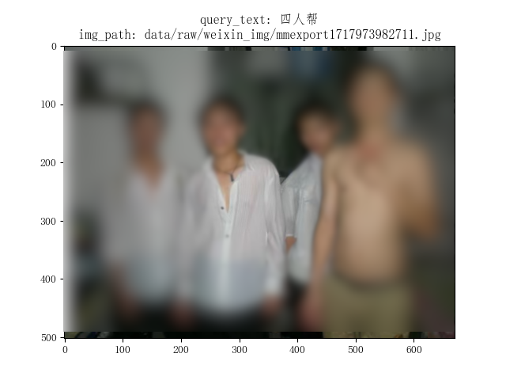
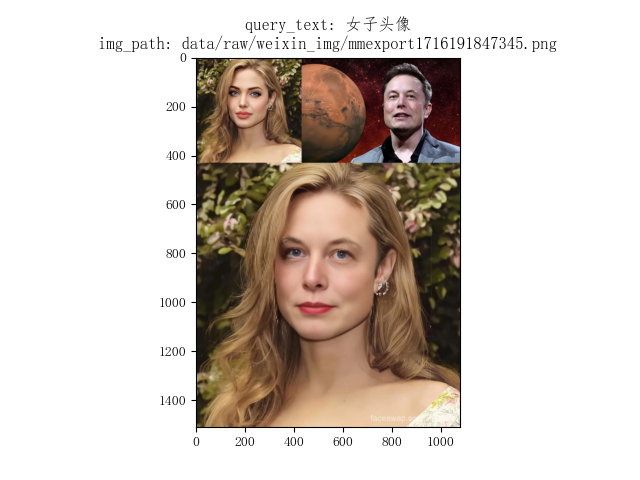

# Clip Text to Image

使用 CLIP 模型完成“文搜图”。离线的个人图片库。


## 项目初衷

几乎人人都有自己的图片库。
所以存放在哪里、使用是否方便可能会是问题。

1. 大多人乐意使用云盘，大概就是斯丹达尔所谓的“幸福的大多数”；
2. 有些人不是很喜欢但能接受上传到陌生云盘，至少用着的时候很方便；
3. 有些人无法接受这种安排，就是免费也不行，宣称使用多么方便也不行；
4. 有些人压根就没想过这回事。

我恰是那第三种人，或许也没有那么不幸，至少建造点东西还是可以收获一些快乐的。哪怕有点简陋。


## 项目情况

- 推理部分本地运行毫无压力，速度一般, 搜索的文图匹配表现尚可；

- 微调模型得借助服务器（24G rtxA5000, 约1小时）；
    一度很担心把机器给跑烧了，但还是手痒没停下：入门消费级别显卡（6G）跑了一夜跑46%左右。

- TODO: 后续看看怎么加入语音搜索能力。再加个树莓派继续DIY，其实真就可以说是爱咋咋地。

- 两个示例：

<!--  -->

<center>
<figure>


</figure>
</center>


## 完整项目目录

模型的微调直接参考[Chinese-CLIP](https://github.com/OFA-Sys/Chinese-CLIP)说明文档，其中
微调时可能会有 torch 版本过高导致的一些问题，我是直接安装 `pip install torch==2.1` 解决。

`queryApp` 基本只涉及模型推理，所以是假设所有数据已经准备好，否则需要先生成相关数据。

```sh
├── Chinese-CLIP    # 基础模型
│   ├── assets
│   ├── cn_clip
│   │   ├── clip
│   │   ├── deploy
│   │   ├── eval
│   │   ├── preprocess
│   │   └── training
│   ├── examples
│   ├── models
│   │   └── hfLLMs
│   ├── notebooks
│   ├── run_scripts
│   └── src
│       └── data
├── fmhData         # 数据部分
│   ├── datasets
│   │   ├── Flickr30k-CN    # 共享数据用于模型微调
│   │   └── XiaoMuZai       # 个人数据
│   └── experiments         # CN-CLIP 模型微调过程数据
│       └── flickr30kcn_finetune_vit-l-14_roberta-base_batchsize64_1gpu
└── queryApp        # 应用部分
    ├── data
    │   ├── external
    │   ├── interim
    │   ├── processed
    │   └── raw
    ├── notebooks
    └── src
        ├── data
        ├── model
        └── visualization
```
